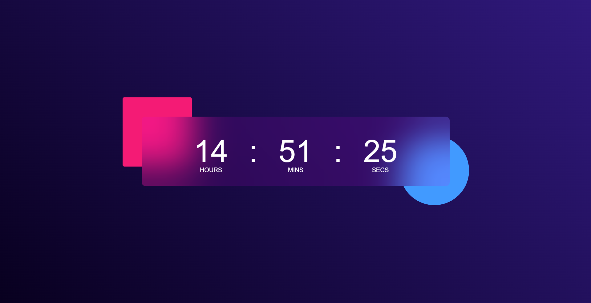

# Digital Clock App

A simple digital clock application built using HTML, CSS, and JavaScript.

[Live Demo](https://digital-clock-html-css-javascript.netlify.app/)

---

## Overview
This project demonstrates:
- Real-time digital clock display.
- Clean and modern UI design.
- Fully responsive design compatible with all screen sizes.

---

## Features
- **Real-Time Display:** Updates every second to show the current time.
- **Responsive Design:** Adjusts seamlessly for desktops, tablets, and mobile devices.
- **User-Friendly Interface:** Minimalist design for easy readability.

---

## Screenshots


---

## Technologies Used

### Frontend
- **HTML5:** Structured content.
- **CSS3:** Styling and responsiveness.
- **JavaScript:** Real-time clock updates.

### Hosting
- Hosted on Netlify: [Live Demo](https://digital-clock-html-css-javascript.netlify.app/)

---

## Installation

### Steps
1. Clone the repository:
   ```bash
   git clone https://github.com/your-username/digital-clock-app.git
   ```

2. Navigate to the project directory:
   ```bash
   cd digital-clock-app
   ```

3. Open the `index.html` file in your browser:
   ```bash
   open index.html
   ```

---

## How It Works
1. **Dynamic Updates:** JavaScript fetches the current time and updates the clock every second.
2. **Responsive Design:** CSS ensures the layout adapts to various screen sizes.
3. **Minimalist UI:** Focuses on readability and usability.

---

## Future Improvements
- Add support for 12-hour and 24-hour formats.
- Include a stopwatch and timer feature.
- Add a dark mode toggle option.

---

## Contribution
Contributions are welcome! Feel free to fork the repository and submit a pull request.

---

## Contact
For queries or feedback, please contact [Shubham](mailto:shubhamjaishu@gmail.com).
